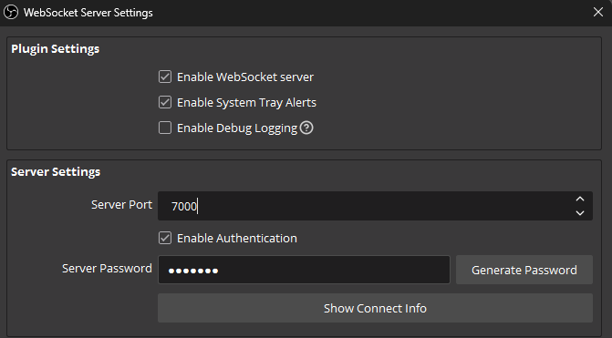
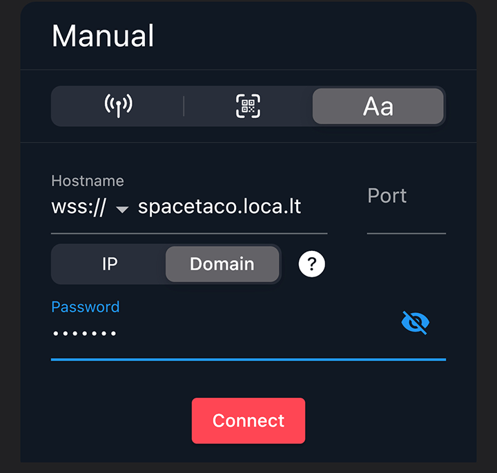

<pre>
  ____  ___  ____  _      _____   ___  ___    ________  ___  ___  ________ 
 / __ \/ _ )/ __/ | | /| / / _ | / _ \/ _ \  /_  __/ / / / |/ / |/ / __/ / 
/ /_/ / _  |\ \   | |/ |/ / __ |/ , _/ ___/   / / / /_/ /    /    / _// /__
\____/____/___/   |__/|__/_/ |_/_/|_/_/      /_/  \____/_/|_/_/|_/___/____/
                                                                           
</pre> 
# OBS Warp Tunnel   

A simple wrapper for localtunnel that keeps it running. Intended to be used with [OBS Blade](https://obs-blade.kounex.com/) so [OBS](https://obsproject.com/) can be manipulated remotely. Localtunnel is unstable crashes frequently, making it unsuitable for IRL streamers trying to access OBS remotely, because maintaining a consistent connection with OBS is paramount. This script maintains uptime, keeps the subdomain, and automatically restarts localtunnel if it crashes. This makes localtunnel a more viable choice for IRL streamers who wish to use OBS Blade to remotely control OBS.

This tool helps make Localtunnel a more viable alternative to ngrok.

## Installation

```
> git clone https://github.com/disasteroftheuniverse/obs-warp-tunnel.git
& cd obs-warp-tunnel 
& npm install
```

## Usage

In OBS, go to `Tools > Websocket Server Settings` to get or set the websocket server port. Also set a websocket server password.  



Edit the included .ENV file to set the `PORT` key to match the corresponding port in OBS and set the `SUBDOMAIN` key to the desired subdomain. 

```
PORT=7000
SUBDOMAIN=SPACETACO
```

Run the included batch file, launch.bat. The console will display address you will need to connect to in OBS Blade.

In OBS Blade, set the host and password, but leave the port blank:



You will now have the ability to remotely control your OBS from your iOS device.


